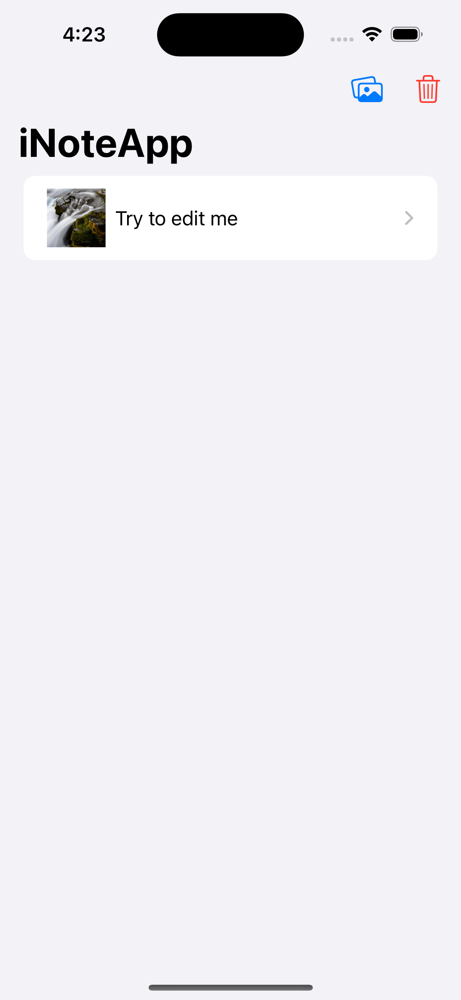
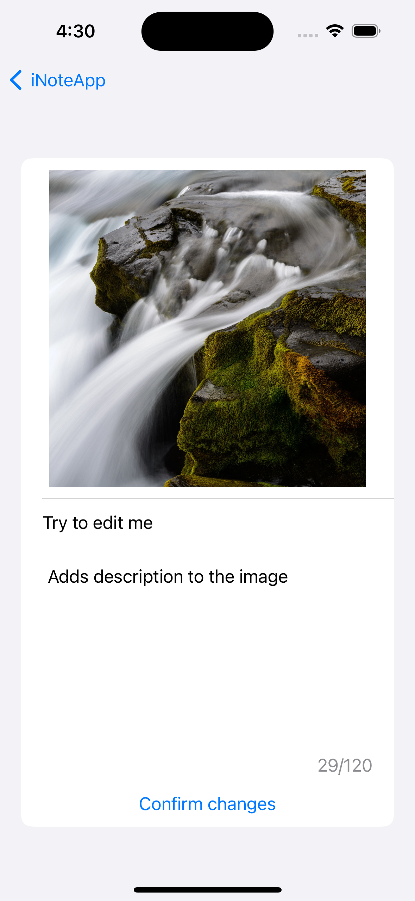

# NoteTakingApp

A simple and intuitive note-taking app built with SwiftUI that allows users to create, edit, and manage notes with images. The app persists data using `UserDefaults` and follows the MVVM design pattern.

## Features

- **Create Notes:** Add new notes with an image, title, and description.
- **Edit Notes:** Edit existing notes to update the title and description.
- **Delete Notes:** Delete notes with a confirmation dialog.
- **Persist Data:** Notes are saved locally using `UserDefaults` to ensure data persistence.
- **Image Picker Integration:** Choose images from the photo library to attach to notes.

## Requirements

- iOS 14.0+
- Xcode 12.0+
- Swift 5.3+

## Installation

Clone the repository:

```bash
git clone https://github.com/ahmedhalilovic/NoteTakingApp.git
cd NoteTakingApp
```

Open the project in Xcode and run it on your simulator or device.

## Code Overview

### `ContentView.swift`
The `ContentView` serves as the main entry point of the app. It initializes the app's environment and provides navigation and toolbar controls. It manages the display of the `HomeView` and conditionally presents the `ImagePicker` for adding new notes.

### `HomeView.swift`
The `HomeView` displays a list of all notes. Each note contains an image, title, and description. Users can navigate to the `NoteDetailView` by tapping on a note.

### `NoteDetailView.swift`
The `NoteDetailView` allows users to view and edit the details of a note. It provides a `TextField` for the title and a `TextEditor` for the description. Users can also confirm changes or delete the note.

### `ImageDataModel.swift`
The `ImageDataModel` handles the data logic of the app. It stores, encodes, decodes, and manages the array of notes using `UserDefaults`. The `ImageNote` struct represents a single note, containing an image, title, and description.

### `ImagePicker.swift`
The `ImagePicker` is a reusable SwiftUI component that allows users to pick an image from their photo library or camera. It integrates UIKit's `UIImagePickerController` into SwiftUI.

## Usage

1. **Adding a Note:**
   - Tap the "Image" button in the toolbar.
   - Choose an image from the photo library.
   - Enter a title and description.
   - Save the note.

2. **Editing a Note:**
   - Tap on an existing note in the list.
   - Edit the title or description.
   - Confirm the changes.

3. **Deleting a Note:**
   - Tap on an existing note.
   - Tap the trash icon in the top-right corner.
   - Confirm the deletion.

4. **Resetting Data:**
   - Tap the trash icon in the toolbar to delete all notes.

## Screenshots

### Home Screen
{:width="100px"}

### Add Note
{:width="100px"}

### Note Detail
{:width="100px"}


## License

This project is licensed under the MIT License. See the [LICENSE](LICENSE) file for more details.

## Contact

For any questions or feedback, feel free to reach out:

- Email: ahmeddhalilovic@icloud.com
- GitHub: [ahmedhalilovic](https://github.com/ahmedhailovic)
